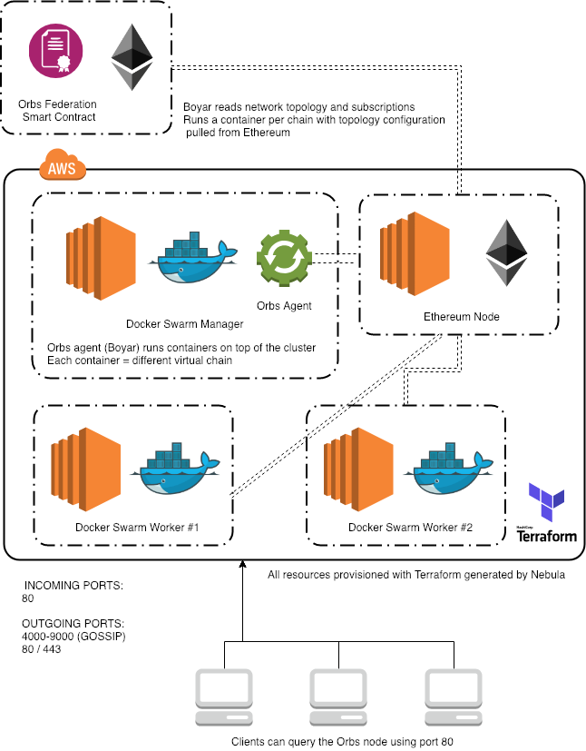

# Orbs Nebula (deprecated)

&nbsp;

**Important: If you're a validator trying to launch an Orbs node - please read the [instructions here](https://github.com/orbs-network/validator-instructions).**

**Deprecation Notice: Nebula is compatible with the deprecated Orbs V1 network. If you're working with the up-to-date V2 network, switch to the replacement tool [Polygon](https://github.com/orbs-network/polygon).**

&nbsp;

In short, Nebula allows you to create an Orbs constellation without too much hassle using our easy-to-use CLI.

Nebula generates Terraform code to provision the required AWS resources so that you have a running Orbs node. Once done, the following illustration highlights the created resources expected in your AWS account.



## Orbs node keypair and Elastic IP

Prior to running nebula to provision your blockchain node, you need to perform 2 tasks:
* Generate an `ECDSA` keypair which will be used by your node (and is required to run nebula)
* Allocate an Elastic IP in your AWS account (in the region in which you plan to run your node obviously)
* Your public key from the first bullet and the Elastic IP should have been provided to Orbs prior
to running this tool for your node to be able to sync correctly to the Orbs Network.

## Prerequisities
For Nebula to work properly you should have the following setup:
- an SSH public key (which is also loaded by the ssh-agent)
  if you have one set at `~/.ssh/id_rsa.pub` you're good to go!
  you can check this by running the following in your terminal:
  `$ cat ~/.ssh/id_rsa.pub`
- Orbs key pair
- an AWS Credentials profile set correctly
  See more [here](https://docs.aws.amazon.com/cli/latest/userguide/cli-configure-profiles.html)
- [Node.js](https://nodejs.org/en/) should be installed version 8 or above

## Installation

Nebula easily integrates into your terminal by installing the NPM package globally

    $ npm install orbs-nebula -g

or if using yarn

    $ yarn global add orbs-nebula

That is all that is required to install Nebula into your system!

## Creating a constellation

Creating a constellation with the CLI is as simple as this:

    $ nebula create --name your-node-name \
                  --orbs-address d27e2e7398e2582f63d0800330010b3e58952ff6 \
                  --orbs-private-key 87a210586f57890ae3642c62ceb58f0f0a54e787891054a5a54c80e1da418253
                  --public-ip 1.2.3.4
                  --region us-west-2

    ....
    [Lots of Terraform output will come out here]
    ....

    Your constellation was created successfully!
    Provided below is the address of your manager node public IP
    The manager IPv4 is: 1.2.3.4

    Your constellation name should be used when wanting to destroy/upgrade
    Constellation name:
    your-node-name

    Example usage:
    nebula destroy --name your-node-name

    Please allow time now for your constellation to finish syncing with the Orbs network
    No further actions required at this point

or if you wish to use a less terminal verbose style , you can create a JSON file naming
the required arguments. Let's assume the following `your-node-name.json` file and content:

    {
        "name": "your-node-name",
        "awsProfile": "default",
        "sshPublicKey": "~/.ssh/id_rsa.pub",
        "orbsAddress": "d27e2e7398e2582f63d0800330010b3e58952ff6",
        "orbsPrivateKey": "87a210586f57890ae3642c62ceb58f0f0a54e787891054a5a54c80e1da418253", 
        "publicIp": "1.2.3.4",
        "region": "us-west-2",
        "nodeSize": "t3.medium",
        "nodeCount": 2,
        "incomingSshCidrBlocks": ["$MY_IP_ADDRESS/32"]
    }

and then we can run the following in our terminal:

    $ nebula create -f your-node-name.json

    ....
    [Lots of Terraform output will come out here]
    ....

    Your constellation was created successfully!
    Provided below is the address of your manager node public IP
    The manager IPv4 is: 1.2.3.4

    Your constellation name should be used when wanting to destroy/upgrade
    Constellation name:
    your-node-name

    Example usage:
    nebula destroy --name your-node-name

    Please allow time now for your constellation to finish syncing with the Orbs network
    No further actions required at this point

How easy is that?! now we can also `git commit` our `your-node-name.json` and have it managed neatly!

Nebula's create command available arguments

| Option                | Mandatory | Type    | Description                                                                                                   | Default             |
|-----------------------|-----------|---------|---------------------------------------------------------------------------------------------------------------|---------------------|
| `orbs-address`        |Yes| string  | Orbs node address - attained from Orbs or from our DKG process                                                |                     |
| `orbs-private-key`    |Yes| string  | Orbs node private key - attained from Orbs or from our DKG process                                            |                     |
| `name`                |Yes| string  | name your constellation! in case non supplied defaults to a random name                                       | Random UUID         |
| `aws-profile`         |Optional| string  | which aws profile name to use when provisioning. Strongly recommended instead of AWS keys for better security | `default`           |
| `testnet`             |Optional| boolean | If supplied, the constellation will join the Orbs Network testnet instead of the mainnet                      | `false`             |
| `public-ip`           |Mandatory| string  | if you wish to attach a static pre-existing EC2 Elastic IP                                                    |                     |
| `node-count`          |Optional| number  | The amount of worker nodes to deploy (the more - the more vChains you can handle)                             | 2                 |
| `node-size`           |Optional| string  | The worker node instance size to use                                                                          | `t2.medium`         |
| `region`              |Optional| string  | The AWS region to deploy to                                                                                   | `us-east-1`         |
| `ssh-public-key`      |Optional| string  | Path to the SSH public key to provision the EC2 machines with                                                 | `~/.ssh/id_rsa.pub` |

## Destroying a constellation

Destroying is even easier and requires even less arguments

    $ nebula destroy --name your-node-name

    ....
    [Lots of Terraform output will come out here]
    ....

    Your constellation has been successfully destroyed!


At the moment - upgrading the constellation is not possible directly through Nebula.
If you wish to upgrade - please destroy and re-create your constellation.
Once this feature is complete - a new version of Nebula will be released.

This was a short introduction as to how Nebula's CLI works - from here follows the more extensive guide
into Nebula's API (less relevant for DevOps and more likely better for automating constellation creation with Node.js - rare cases at this stage)

# Programmatic API Documentation

Orbs is a public blockchain infrastructure built for the needs of decentralized apps with millions of users. For more information, please check https://orbs.com and read the [white papers](https://orbs.com/white-papers).
Nebula is a tool within the Orbs eco system of tooling providing turn-key solution for setting up an Orbs `constellation` aka blockchain `node` in common worldly terminology.

This repo contains a CLI and an API part of the Nebula tool. which can be used for developers (or DevOps) which want a bit of a lower level or automation friendly access to provisioning and running an Orbs `constellation`.
The project is thoroughly tested with unit tests and E2E tests running Nebula's logic and mechanics against an Amazon account.
Bear in mind that running the E2E tests require active `AWS IAM` access and secret keys

Nebula is very simple! in essence it is about the following sentence:

    You provide us with the keys and we'll provision and run everything for you

This project is designed to be DevOps friendly and prints out all information out to the screen that the tool generates. 
In the spririt of decentralization the code is obviously open source and we will do our best to make sure you understand what this tool
essentially does for you.

## So what is it that Nebula does?

an Orbs `constellation` is currently designed to run on top of AWS. In light of this: Nebula essentially receives as input from the user the following:

* AWS Access/secret pair
* Orbs key pair (Obtained through a process called DKG)
* SSH Key (to be installed on the machines provisioned with this tool)

With these supplied Nebula can begin provisioning the required resources on top of AWS.
Nebula will create a new folder within your machine and will generate [Terraform](https://www.terraform.io/) scripts to go into
these folder. These scripts are responsible for generating your completely new and shiny infrastructure that is required to run
an Orbs `constellation` in AWS.

Of course you can modify and customize a couple of things such as the instances type 
(incase you want to handle more virtual chains than other constellations) but we'll get into that a bit later.

Nebula then runs the generated `Terraform` code, provisioning the entire infrastructure required. 
Once in-place Nebula performs the following:

* Update the server's packages and check for any OS-level security packages which might require updating.
* Install all the required software into the servers provisioned for Orbs to run.
* Aquire network topology for the entire Orbs Blockchain Network
* Startup `boyar` (our internal agent responsible to manage the various `virtual chains`)
* at this point `boyar` will start running `virtual chains` on your `constellation` and have them sync with the network (which can take time!)

At this point you should be good! Nebula has setup the `constellation` for you.

### Prerequisites

* Make sure [Node.js](https://nodejs.org/en/download/) is installed (version 8 or later, we recommend version 10 and up).

  > Verify with `node -v`
### Installing Nebula

You can use `orbs-nebula-sdk` in one of two ways:

* If you want to incorporate it into an existing Node project simply install it by running:
`npm install orbs-nebula-sdk --save`
within your project's folder

* If you wish to start a new project for the sole purpose of maintaining an Orbs constellation you can start
  a new Node project by running `npm init` within a new folder and then of course install the package
  in similar fashion to what is shown above.

### Run

Running Nebula in the simplest way involves code such as the following

```js
const nebulaSdk = require('orbs-nebula-sdk');
const cloud = {
    type: nebulaSdk.clouds.aws,
    region: 'us-east-1',
    instanceType: 't3.medium'
};
const keys = {
    aws: {
        accessKey: 'YOUR_AWS_ACCESS_KEY',
        secretKey: 'YOUR_AWS_SECRET_KEY'
    },
    ssh: {
        path: '~/.ssh/id_rsa.pub',
    },
    orbs: {
        nodeKeys: {
            address: "d27e2e7398e2582f63d0800330010b3e58952ff6",
            privateKey: "87a210586f57890ae3642c62ceb58f0f0a54e787891054a5a54c80e1da418253",
            leader: "a328846cd5b4979d68a8c58a9bdfeee657b34de7"
        }
    }
};
nebulaSdk.createConstellation({ cloud, keys })
.then((result) => {
    console.log(result); // ->
    // { ok: true, 
    //   spinContext: '65b2c790-125b-11e9-b828-8781a9e90148',
    //   manager: {
    //     ip: '1.2.3.4'
    //   }
    // }
    console.log('Constellation created successfully!');
    console.log('Swarm master public IP:', result.manager.ip);
});
```

### Test

* Running the tests require an active AWS credentials set appropriately in the following environment variables

```
 $ export AWS_ACCESS_KEY_ID='YOUR_AWS_ACCESS_KEY'
 $ export AWS_SECRET_ACCESS_KEY='YOUR_AWS_SECRET_KEY'
```

* Once that is in place, and within the same terminal navigate you can clone this repository from GitHub by running the following

```
 $ git clone https://github.com/orbs-network/nebula
```

* Install the project's dependencies

```
 $ cd nebula && npm install
```

* and finally, run the tests by running
```
  $ npm test
```

Please note that this command will run all of the provided tests which at the moment are end to end and unit tests.

### Inspecting your Orbs Constellation's Health and metrics

TBD

## License

MIT
